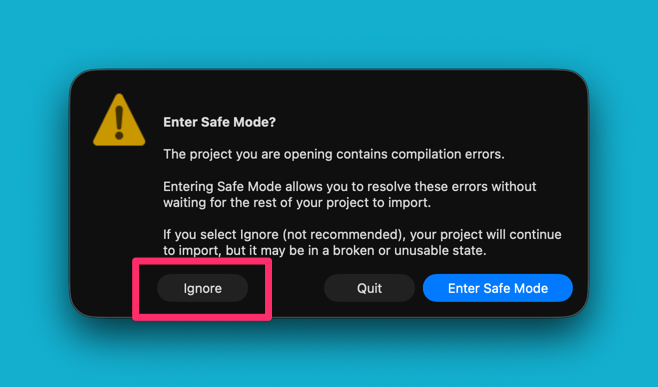
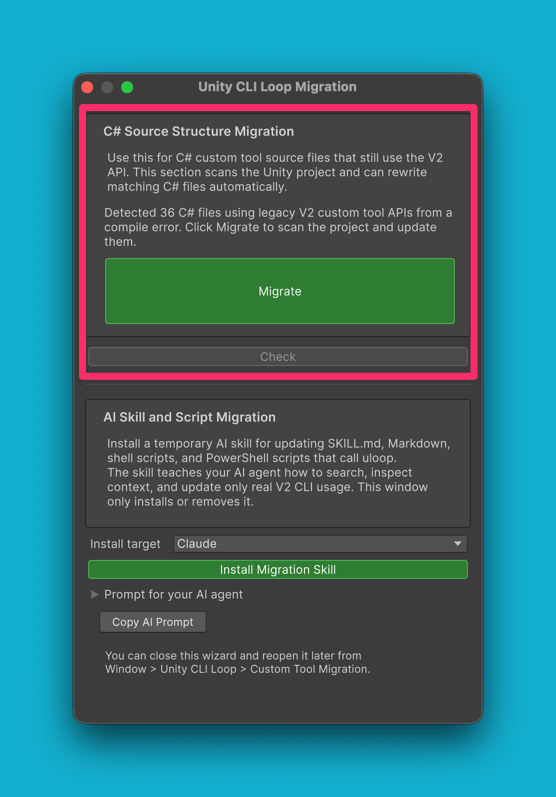
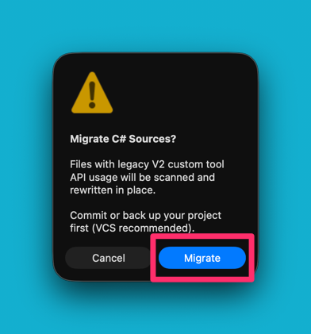
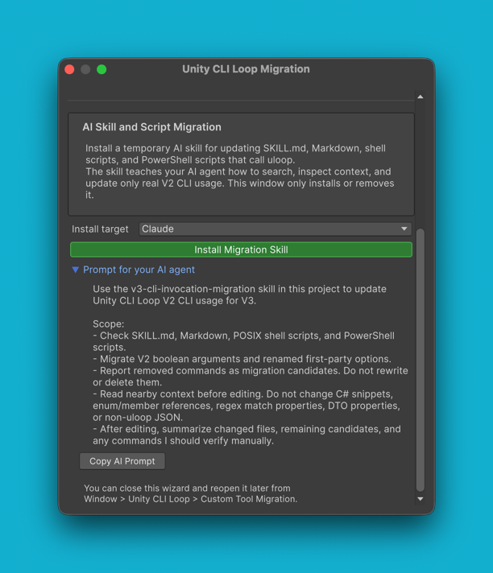

# Migrating Custom Tools and Skills to V3

English | [日本語](migration-v2-to-v3_ja.md)

> [!NOTE]
> **Most users do not need this guide.** If you have no C# custom tools and no hand-written skills or scripts that call `uloop`, upgrading is just three steps: raise the Unity package version, press **Install CLI** (or **Update CLI**) in `Window > Unity CLI Loop > Settings`, then press **Install Skills** (or **Update Skills**) in the same window. You are done — you can stop reading here. For what changed in V3, see [What's New in V3](whats-new-v3.md).

## Who needs this guide

Read on if either of these applies to your project:

- **You have C# custom tools written against the V2 API** — classes deriving from the V2 tool base type, or anything else importing the `io.github.hatayama.uLoopMCP` namespace. Follow Step 1 through Step 2; the migration wizard rewrites them for you.
- **You have `SKILL.md` files, Markdown docs, POSIX shell scripts, or PowerShell scripts that invoke `uloop`** — V3 changed the boolean option syntax and removed several commands, so existing invocations can silently break. Follow Step 3 onward.

If both apply, work through the guide from the top in order.

## What to expect

**Upgrading a project that contains V2-API custom tools will produce compile errors. This is expected.** The V3 extension API lives in a new namespace with new type names, so V2 sources no longer compile. Do not start fixing those errors by hand — the built-in migration wizard scans the project and rewrites the affected files for you, and hand-edits made first only make its job harder.

Before you begin, **commit your work or take a backup**. The wizard rewrites matching files in place, and its confirmation dialog says the same thing: *"Commit or back up your project first (VCS recommended)."* A version control system is the easiest way to review exactly what the wizard changed.

## Step 1: Start Unity on V3 and decline Safe Mode

As a precondition, the steps below start from **the Unity Editor starting up with the updated V3 package**. How you get there depends on how you updated the package:

- **If you edited `Packages/manifest.json` directly while Unity was closed** — just start Unity. No restart is needed; this launch is already the first startup on V3.
- **If you updated from Package Manager while Unity was running** — close Unity and reopen it. The dialog that asks whether to enter Safe Mode only appears while the Editor is starting up, so a running session never shows it and you cannot follow the rest of this guide.

On startup, Unity finds the compile errors from the V2 sources and asks whether to enter Safe Mode. **Press `Ignore` so that Unity starts up without entering Safe Mode.**

**Why this matters:** Safe Mode loads only a whitelisted set of assemblies. The Unity CLI Loop editor extension is not on that whitelist, so in Safe Mode the package code never runs and **the migration window cannot open**. Declining Safe Mode is what makes the rest of this guide possible.



> [!WARNING]
> If you previously turned off `Preferences > Asset Pipeline > Show Enter Safe Mode Dialog`, Unity enters Safe Mode **without asking**, and you will never get the chance to press `Ignore`. Turn that preference back on, then restart the Editor again.

Entering Safe Mode by accident is recoverable. Because the package code does not run in Safe Mode, nothing is recorded about the migration state — restart Unity, press `Ignore`, and the wizard opens as described below.

Launching from the CLI does not avoid this dialog. `uloop launch` shows the same prompt: Unity's `-ignorecompilererrors` switch does not suppress it in GUI mode.

## Step 2: Press Migrate

Once the Editor is up, the `Unity CLI Loop Migration` window **opens by itself**. This automatic open fires on the first startup after the package major version goes from V2 to V3, so it is a one-time event rather than something you can trigger again by restarting. **If the window did not open on its own**, open it manually from `Window > Unity CLI Loop > Custom Tool Migration`.



The `C# Source Structure Migration` section reports the detection from the compile error like this (`{N}` is the number of affected files; the wording drops the count when it could not be determined):

> Detected {N} C# files using legacy V2 custom tool APIs from a compile error. Click Migrate to scan the project and update them.

Press **`Migrate`**. A confirmation dialog titled `Migrate C# Sources?` appears, warning that the files are rewritten in place and that you should commit or back up first. Confirm with **`Migrate`**.



After you confirm, the project scan produces a definite file list and the status changes to `Found {N} C# files that need V3 migration.`. While the rewrite runs, the button reads `Migrating...` and the status line reports progress as `{n}/{N} steps complete.`. When it finishes you get:

> Migration complete. No further C# migration is needed.

At that point the rewritten sources compile, and the errors you saw on startup are gone.

### What the status text and button labels mean

| Status text | Meaning |
|---|---|
| `C# source migration status has not been checked.` | The project has not been scanned yet in this session. |
| `Detected legacy V2 custom tool API usage from a compile error.` | The compile error indicates V2 API usage. Pressing `Migrate` runs the actual project scan and rewrites what it finds. |
| `Found {N} C# files that need V3 migration.` | A project scan completed and found `{N}` files to rewrite. |
| `No C# source structure migration is needed.` | The scan found nothing to rewrite. |
| `Migration complete. No further C# migration is needed.` | The rewrite finished successfully. |

| Button label | Meaning |
|---|---|
| `Migrate` | Ready to scan and rewrite. |
| `Migrating...` | The rewrite is in progress. |
| `Check required` | The status has not been checked yet; press it to scan. |
| `Nothing to migrate` | The scan found no files needing migration. |

### What the wizard rewrites

- **Namespace** — `io.github.hatayama.uLoopMCP` becomes `io.github.hatayama.UnityCliLoop.ToolContracts` for tool contract types.
- **Base types** — `AbstractUnityTool` becomes `UnityCliLoopTool<TSchema, TResponse>`, `BaseToolSchema` becomes `UnityCliLoopToolSchema`, and `BaseToolResponse` becomes `UnityCliLoopToolResponse`.
- **Attribute** — `[McpTool]` becomes `[UnityCliLoopTool]`. The `Description` argument is dropped, while `DisplayDevelopmentOnly` and `RequiredSecuritySetting` are carried over.
- **Assembly definition references** — `uLoopMCP.Editor` and `uLoopMCP.Runtime` references in your `.asmdef` files are repointed at the V3 assemblies.

## Step 3: Migrate skills and scripts that call uloop

The second section, `AI Skill and Script Migration`, covers the other half of the job: your `SKILL.md` files, Markdown docs, shell scripts, and PowerShell scripts that invoke `uloop`.



**This window does not rewrite those files itself.** It only installs and removes a temporary AI skill; your AI agent does the actual editing. The workflow is:

1. Press **`Install Migration Skill`**. This installs a temporary skill named `v3-cli-invocation-migration` into your project.
2. Expand the **`Prompt for your AI agent`** foldout and press **`Copy AI Prompt`**.
3. Paste that prompt into your AI agent and let it run. The skill teaches the agent to search for `uloop` invocations, read the surrounding context, and update only genuine V2 CLI usage — leaving C# snippets, enum references, and unrelated JSON alone.
4. Review the agent's changes. It reports which files it edited, which removed commands it found as migration candidates, and what you should verify by hand.

## CLI option changes

The AI agent applies these changes for you. This table is here so you can review its work — the canonical source is `Packages/src/TemporarySkills~/v3-cli-invocation-migration/Skill/references/first-party-v2-to-v3.md`.

### Boolean argument rules

V3 boolean options do not take a value. How a V2 invocation converts depends on the V3 option's default:

| V2 form | V3 form |
|---|---|
| `--flag true` / `--flag=true` | `--flag`, when the V3 option is a positive default-false boolean |
| `--flag false` / `--flag=false` | remove the option, when the V3 default is already false |
| `--flag true` / `--flag=true` | remove the option, when the V3 default is already true |
| `--flag false` / `--flag=false` | use the V3 negative option, when the V3 default is true |

For any boolean not listed below, run `uloop <command> --help`: every V3 flag prints its default as `default: enabled` (true) or `default: disabled` (false).

### Renamed first-party options

| V2 command | V2 option | V3 replacement |
|---|---|---|
| `uloop compile` | `--force-recompile true` | `--force-recompile` |
| `uloop compile` | `--force-recompile false` | remove |
| `uloop compile` | `--wait-for-domain-reload true` or bare | remove |
| `uloop compile` | `--wait-for-domain-reload false` | `--no-wait-for-domain-reload` |
| `uloop compile` | `--reload-external-scene-changes true` | remove |
| `uloop compile` | `--reload-external-scene-changes false` | `--stop-on-external-scene-changes` |
| `uloop run-tests` | `--save-before-run true` or bare | remove |
| `uloop run-tests` | `--save-before-run false` | `--fail-on-unsaved-changes` |
| `uloop record-input` | `--show-overlay true` | remove |
| `uloop record-input` | `--show-overlay false` | `--no-show-overlay` |
| `uloop replay-input` | `--show-overlay true` | remove |
| `uloop replay-input` | `--show-overlay false` | `--no-show-overlay` |
| `uloop get-hierarchy` | `--include-components true` | remove |
| `uloop get-hierarchy` | `--include-components false` | `--no-include-components` |
| `uloop get-hierarchy` | `--include-inactive true` | remove |
| `uloop get-hierarchy` | `--include-inactive false` | `--no-include-inactive` |
| `uloop execute-dynamic-code` | `--compile-only true` | `--compile-only` |
| `uloop execute-dynamic-code` | `--compile-only false` | remove |

> [!WARNING]
> Two of these option names are also **valid V3 syntax on a different command**, so never migrate them by name alone. Bare `--wait-for-domain-reload` is a valid default-false flag on `uloop execute-dynamic-code`, and bare `--include-inactive` is a valid default-false flag on `uloop find-game-objects`. Check which command an invocation belongs to before editing it.

### Removed and renamed commands

The six commands from `capture-window` through `get-menu-items` were already removed or renamed during V2's lifetime and do not exist in the final V2 release. They are listed here in case they linger in scripts written for older V2 versions.

| V2 command | V3 handling |
|---|---|
| `uloop capture-window` | Renamed to `uloop screenshot`. |
| `uloop unity-search` | Removed. Use `uloop execute-dynamic-code`, or `uloop find-game-objects` for ordinary scene lookups. |
| `uloop get-unity-search-providers` | Removed. Use `uloop execute-dynamic-code`. |
| `uloop get-provider-details` | Removed. Use `uloop execute-dynamic-code`. |
| `uloop execute-menu-item` | Removed. Use `uloop execute-dynamic-code` with `EditorApplication.ExecuteMenuItem(...)`. |
| `uloop get-menu-items` | Removed. Use `uloop execute-dynamic-code`. |
| `uloop get-version` | Removed as a user command. Use `uloop --version` for the CLI version, or `uloop execute-dynamic-code` for the Unity Editor version. |
| `uloop get-project-info` | Removed. Use `uloop execute-dynamic-code` to read the project metadata you need. |

The migration skill reports these as candidates rather than rewriting them, because the replacement depends on what your script was doing.

## Step 4: Clean up the temporary skill

Once your docs and scripts are migrated, remove the temporary skill. The window states this explicitly:

> This skill is temporary. Remove it once your docs and scripts are migrated to V3 CLI syntax.

Press **`Remove Migration Skill`** in the wizard, or remove it from the CLI for each target you installed it to:

```bash
uloop skills uninstall-v3-migration --claude
uloop skills uninstall-v3-migration --codex
```

## Verify

Work through these three checks:

```bash
# 1. The project compiles with no errors
uloop compile

# 2. Your custom tools are registered and callable
uloop list
```

- `uloop compile` should report zero errors. Warnings unrelated to the migration are fine.
- `uloop list` should include every custom tool you had before the upgrade, under the same tool names — the migration changes namespaces and base types, not your `ToolName` values.
- Finally, run one of your own skills or scripts end to end and confirm the `uloop` invocations inside it still behave as expected. Option syntax errors surface immediately as a failed command rather than a silent no-op.

## Manual migration reference

If you prefer to migrate by hand, these are the concrete replacements the wizard performs. The legacy namespace is `io.github.hatayama.uLoopMCP`; the V3 tool contract namespace is `io.github.hatayama.UnityCliLoop.ToolContracts`.

| V2 type | V3 type |
|---|---|
| `AbstractUnityTool` | `UnityCliLoopTool` |
| `IUnityTool` | `IUnityCliLoopTool` |
| `BaseToolSchema` | `UnityCliLoopToolSchema` |
| `BaseToolResponse` | `UnityCliLoopToolResponse` |
| `McpToolAttribute` (`[McpTool]`) | `UnityCliLoopToolAttribute` (`[UnityCliLoopTool]`) |
| `McpConstants` | `UnityCliLoopConstants` |
| `SecuritySettings` | `UnityCliLoopSecuritySetting` |
| `ToolParameterSchemaGenerator` | `UnityCliLoopToolParameterSchemaGenerator` |
| `ParameterValidationException` | `UnityCliLoopToolParameterValidationException` |
| `CustomToolManager` | `UnityCliLoopToolRegistrar` |

| V2 assembly reference | V3 assembly reference |
|---|---|
| `uLoopMCP.Editor` | `UnityCLILoop.Application` |
| `uLoopMCP.Runtime` | `UnityCLILoop.Runtime` |

## Troubleshooting

**Unity entered Safe Mode.** The package code does not run there, so nothing was recorded and nothing was lost. Restart the Editor and press `Ignore` at the prompt. If you were never asked, re-enable `Preferences > Asset Pipeline > Show Enter Safe Mode Dialog` and restart again.

**The wizard did not open automatically.** First confirm the Editor actually went through a fresh startup on V3 — the automatic open happens during startup, on the first launch after the major version goes from V2 to V3. If you updated from Package Manager while Unity was running, that session does not count; restart the Editor. Open it manually from `Window > Unity CLI Loop > Custom Tool Migration`; everything in Step 2 onward works the same way from the manual route.

**Compile errors remain after `Migrate` finishes.** Read the remaining errors before doing anything else: sources that mix custom logic with V2 API calls can need a manual touch-up that the rules do not cover. Use your VCS diff to see what the wizard changed, restore from your commit or backup if you want a clean slate, and work through the Manual migration reference above for whatever is left.

**Your AI agent cannot see the temporary skill.** The skill is installed per target, so check that you installed it for the agent you are actually using (`--claude`, `--codex`, and so on) rather than a different one. Re-running `uloop skills install` for the right target refreshes the installed copies.
