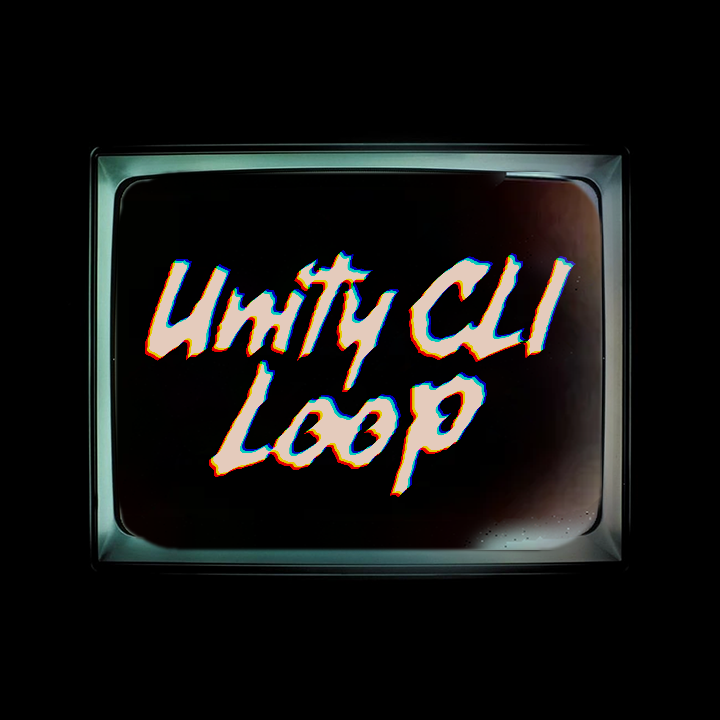
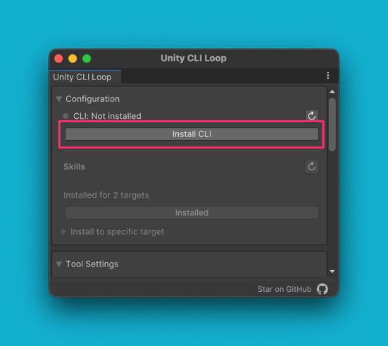
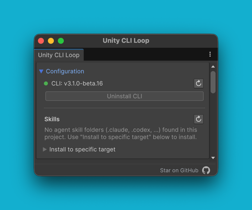
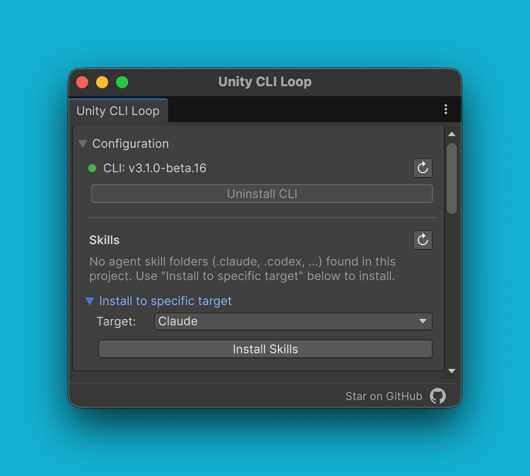

# Unity CLI Loop

[English](README.md) | 日本語

[](https://unity3d.com/)
[](LICENSE.md)<br>


![Codex](https://img.shields.io/badge/Codex-111?logo=data:image/svg+xml;base64,PHN2ZyByb2xlPSJpbWciIHZpZXdCb3g9IjAgMCAyNCAyNCIgeG1sbnM9Imh0dHA6Ly93d3cudzMub3JnLzIwMDAvc3ZnIj48cGF0aCBmaWxsPSJ3aGl0ZSIgZD0iTTIyLjI4MTkgOS44MjExYTUuOTg0NyA1Ljk4NDcgMCAwIDAtLjUxNTctNC45MTA4IDYuMDQ2MiA2LjA0NjIgMCAwIDAtNi41MDk4LTIuOUE2LjA2NTEgNi4wNjUxIDAgMCAwIDQuOTgwNyA0LjE4MThhNS45ODQ3IDUuOTg0NyAwIDAgMC0zLjk5NzcgMi45IDYuMDQ2MiA2LjA0NjIgMCAwIDAgLjc0MjcgNy4wOTY2IDUuOTggNS45OCAwIDAgMCAuNTExIDQuOTEwNyA2LjA1MSA2LjA1MSAwIDAgMCA2LjUxNDYgMi45MDAxQTUuOTg0NyA1Ljk4NDcgMCAwIDAgMTMuMjU5OSAyNGE2LjA1NTcgNi4wNTU3IDAgMCAwIDUuNzcxOC00LjIwNTggNS45ODk0IDUuOTg5NCAwIDAgMCAzLjk5NzctMi45MDAxIDYuMDU1NyA2LjA1NTcgMCAwIDAtLjc0NzUtNy4wNzI5em0tOS4wMjIgMTIuNjA4MWE0LjQ3NTUgNC40NzU1IDAgMCAxLTIuODc2NC0xLjA0MDhsLjE0MTktLjA4MDQgNC43NzgzLTIuNzU4MmEuNzk0OC43OTQ4IDAgMCAwIC4zOTI3LS42ODEzdi02LjczNjlsMi4wMiAxLjE2ODZhLjA3MS4wNzEgMCAwIDEgLjAzOC4wNTJ2NS41ODI2YTQuNTA0IDQuNTA0IDAgMCAxLTQuNDk0NSA0LjQ5NDR6bS05LjY2MDctNC4xMjU0YTQuNDcwOCA0LjQ3MDggMCAwIDEtLjUzNDYtMy4wMTM3bC4xNDIuMDg1MiA0Ljc4MyAyLjc1ODJhLjc3MTIuNzcxMiAwIDAgMCAuNzgwNiAwbDUuODQyOC0zLjM2ODV2Mi4zMzI0YS4wODA0LjA4MDQgMCAwIDEtLjAzMzIuMDYxNUw5Ljc0IDE5Ljk1MDJhNC40OTkyIDQuNDk5MiAwIDAgMS02LjE0MDgtMS42NDY0ek0yLjM0MDggNy44OTU2YTQuNDg1IDQuNDg1IDAgMCAxIDIuMzY1NS0xLjk3MjhWMTEuNmEuNzY2NC43NjY0IDAgMCAwIC4zODc5LjY3NjVsNS44MTQ0IDMuMzU0My0yLjAyMDEgMS4xNjg1YS4wNzU3LjA3NTcgMCAwIDEtLjA3MSAwbC00LjgzMDMtMi43ODY1QTQuNTA0IDQuNTA0IDAgMCAxIDIuMzQwOCA3Ljg3MnptMTYuNTk2MyAzLjg1NThMMTMuMTAzOCA4LjM2NCAxNS4xMTkyIDcuMmEuMDc1Ny4wNzU3IDAgMCAxIC4wNzEgMGw0LjgzMDMgMi43OTEzYTQuNDk0NCA0LjQ5NDQgMCAwIDEtLjY3NjUgOC4xMDQydi01LjY3NzJhLjc5Ljc5IDAgMCAwLS40MDctLjY2N3ptMi4wMTA3LTMuMDIzMWwtLjE0Mi0uMDg1Mi00Ljc3MzUtMi43ODE4YS43NzU5Ljc3NTkgMCAwIDAtLjc4NTQgMEw5LjQwOSA5LjIyOTdWNi44OTc0YS4wNjYyLjA2NjIgMCAwIDEgLjAyODQtLjA2MTVsNC44MzAzLTIuNzg2NmE0LjQ5OTIgNC40OTkyIDAgMCAxIDYuNjgwMiA0LjY2ek04LjMwNjUgMTIuODYzbC0yLjAyLTEuMTYzOGEuMDgwNC4wODA0IDAgMCAxLS4wMzgtLjA1NjdWNi4wNzQyYTQuNDk5MiA0LjQ5OTIgMCAwIDEgNy4zNzU3LTMuNDUzN2wtLjE0Mi4wODA1TDguNzA0IDUuNDU5YS43OTQ4Ljc5NDggMCAwIDAtLjM5MjcuNjgxM3ptMS4wOTc2LTIuMzY1NGwyLjYwMi0xLjQ5OTggMi42MDY5IDEuNDk5OHYyLjk5OTRsLTIuNTk3NCAxLjQ5OTctMi42MDY3LTEuNDk5N1oiLz48L3N2Zz4=)


<p align="center">
    <br>
    <sub>(Logo inspired by Daft Punk's <i>Human After All</i> album art)</sub>  
</p>
  

CLIを通じて、AIエージェントがUnityプロジェクトのコンパイル・テスト・操作を各種LLMツールから実行できるようにします。

AI駆動の開発ループを既存のUnityプロジェクト内で自律的に回し続けるために設計されています。

> [!IMPORTANT]
> - **[V3の新機能](Packages/src/Documentation~/whats-new-v3_ja.md)** — ネイティブGo CLIへの移行、ポート管理の廃止、`pause-point` の追加など、V2からの変更点
> - **[カスタムツール／スキルのV3移行ガイド](Packages/src/Documentation~/migration-v2-to-v3_ja.md)** — C#カスタムツールや、`uloop` を呼び出す自作スキル／スクリプトを持っている人向け。それ以外の人は、パッケージとCLIを更新するだけで移行できます

# コンセプト
Unity CLI Loopは、「AIがUnityプロジェクトの実装をできるだけ人手を介さずに進められる」ことを目指して作られた Unity連携ツールです。
人間が手で行っていたコンパイル、Test Runner の実行、ログ確認、シーン編集、画面キャプチャによるUIレイアウト確認、さらには実装した機能が本当に動くかどうかを実際に操作して確かめる動作確認までを、LLM ツールからまとめて行えるようにします。

Unity CLI Loopのコアとなるコンセプトは次の4つです。

1. **AIが自律的にビルド・テスト・ログ解析・修正を回し続ける「自律開発ループ」** — コードを書き換えずに任意の行で実行を止め、その瞬間の変数を読み取って原因を特定することもできます。`compile`, `run-tests`, `get-logs`, `clear-console`, `pause-point`
2. **シーン構築、オブジェクト操作、メニュー実行、スクリーンショットからのUI改善など、Unity Editorの操作をAIに委任** — `execute-dynamic-code`, `screenshot`
3. **PlayMode中の自動テスト — ボタンクリック、ドラッグ、キーボード入力、入力の記録・再生、ゲーム動作の検証をAIが実行** — `simulate-mouse-ui`, `simulate-mouse-input`, `simulate-keyboard`, `record-input`, `replay-input`, `execute-dynamic-code`, `screenshot`
4. **上記を最小限のツール数で実現する** → [設計思想](#設計思想)

https://github.com/user-attachments/assets/569a2110-7351-4cf3-8281-3a83fe181817

# インストール

> [!WARNING]
> 以下のソフトウェアが必須です
>
> - **Unity 2022.3以上**
>
> CLIはネイティブバイナリで配布されるため、**Node.jsは不要です。**

ここでインストールするのはUnityパッケージです。CLI本体（ネイティブバイナリ）は、パッケージ導入後に[クイックスタートのステップ1](#ステップ1-cliのインストール)でインストールします。Unityを経由せずterminalだけでCLIを入れる方法も、同じステップに畳んで記載しています。

## Unity Package Manager経由

1. Unity Editorを開く
2. Window > Package Managerを開く
3. 「+」ボタンをクリック
4. 「Add package from git URL」を選択
5. 以下のURLを入力：
```text
https://github.com/hatayama/unity-cli-loop.git?path=/Packages/src
```

## OpenUPM経由（推奨）

グローバルな `uloop` CLI が PATH に入った状態で、プロジェクトルートのターミナルから（または `--project-path` を指定して）Unity パッケージを導入できます。

```bash
uloop package install
uloop package status
```

`uloop package install` は OpenUPM の scoped registry と `io.github.hatayama.uloopmcp` 依存を `Packages/manifest.json` に書き込みます。OpenUPM の `dist-tags.latest` ではなく特定バージョンを入れたいときは `--version <x.y.z>` を付けます。導入状態の確認には `uloop package status` を使います。

### 手動で設定する場合（Unity Package Manager）

1. Project Settingsウィンドウを開き、Package Managerページに移動
2. Scoped Registriesリストに以下のエントリを追加：
```text
Name: OpenUPM
URL: https://package.openupm.com
Scope(s): io.github.hatayama.uloopmcp
```

3. Package Managerウィンドウを開き、My RegistriesセクションのOpenUPMを選択。Unity CLI Loopが表示されます。

> [!NOTE]
> `com.unity.inputsystem` は optional dependency になりました。`simulate-keyboard`、`simulate-mouse-input`、`record-input`、`replay-input`、Recordings ウィンドウを使いたい場合だけ追加してください。
> `com.unity.test-framework` も optional dependency です。`run-tests` で Unity Test Runner を実行したい場合だけ追加してください。

# クイックスタート

## ステップ1: CLIのインストール

Window > Unity CLI Loop > Settingsを選択します。専用ウィンドウが開くので、**CLI** ボタンが青くなっていなければ **Install CLI** を押してください。

installerはグローバルな`uloop` dispatcherをPATH上に配置します。プロジェクト固有の`uloop-project-runner` binaryは、各プロジェクトの`.uloop/project-runner-pin.json`に従ってuser cacheへ自動的にdownloadされます。

<details>
<summary>V2プロジェクトと併用する場合</summary>

v2とv3のプロジェクトを併用するときも、v3 dispatcherをインストールしたままにしてください。Unityがプロジェクトをv2系の`io.github.hatayama.uloopmcp` packageへ解決している場合、dispatcherは同じバージョンのv2 `uloop-cli` releaseをバージョン別user cacheへ自動的にインストールし、コマンドを委譲します。解決済みpackageのバージョンは、downgrade後に残った古いv3 project-runner pinより優先されます。初回のnpmインストールとv2モードの注記はstderrへ出力されるため、stdoutには委譲先コマンドの出力だけが残ります。v3プロジェクトはpinで選ばれたproject runnerを引き続き使用します。

グローバルな`install`、`update`、`uninstall`、`launch`コマンドは、どのプロジェクトでもv3 dispatcherが処理します。検出されたv2プロジェクトでは、それ以外のプロジェクトコマンド、help、プロジェクトスコープのversion表示が委譲されます。

v2への委譲には、初回コマンドでcacheを作成するnpmを含むNode.js 22以降が必要です。v2プロジェクトのSettingsウィンドウでは、**Update CLI**または**Downgrade CLI**を押さないでください。委譲先CLIが同じv2バージョンを返すため通常はボタン自体が表示されませんが、使用するとグローバルnpm版CLIが復活し、PATHの順序によってv3 dispatcherが隠れる可能性があります。

</details>

<details>
<summary>CLIだけをterminalからinstallする場合はこちら</summary>

Unity Package の setup を開かず、standalone の global CLI だけを入れたい場合に使ってください。
インストーラは `Packages/src/project-runner-pin.json` の digest 一覧でアーカイブを検証します（Unity の **Install CLI** ボタンと同じ pin）。
任意の環境変数: `ULOOP_REF`（pin を取る git ref。既定は `main`）、`ULOOP_INSTALL_DIR`。
`ULOOP_VERSION` は pin の `dispatcherReleaseTag` と一致する場合のみ有効です。

> [!NOTE]
> terminal install も Unity GUI と同じ repository pin を信頼源にします。明示的に
> `ULOOP_ARCHIVE_MANIFEST`（Sigstore 検証由来）を渡す手動フローは、任意の release tag を選ぶ hardened option として残っています。

macOS、Windows Git Bash の場合:

```sh
curl -fsSL https://raw.githubusercontent.com/hatayama/unity-cli-loop/main/scripts/install.sh | sh
```

Windows PowerShell の場合:

```powershell
irm https://raw.githubusercontent.com/hatayama/unity-cli-loop/main/scripts/install.ps1 | iex
```

### 手動の attestation 検証付き install（release tag を自分で選ぶ）

最初にOSまたはパッケージ管理経由で`gh`（ログイン済み）と`jq`を導入してください。以下のコマンドはこの2つを自動では導入せず、代替手段にもフォールバックしません。最新のdispatcher Release tagは自動で解決されます。特定のバージョンを入れたい場合は、`RELEASE_TAG`にimmutableなタグ（例: `dispatcher-v3.0.0`）を直接指定してください。

コマンドがやっていることは順に次の5つです。

1. 最新のdispatcher Release tagを解決する（`RELEASE_TAG`）
2. Releaseからインストーラと、その署名情報（sigstore attestation bundle）を取得する（`gh release download`）
3. インストーラが「このリポジトリのCIが、このタグのコミットからビルドしたもの」であることを検証する（`gh attestation verify`）
4. 検証済みの署名情報から、CLI本体アーカイブの正しいハッシュ一覧を取り出す（`jq`）
5. ハッシュ一覧を渡してインストーラを実行する。アーカイブが一覧と一致しなければ、実行前に中断されます

macOS、Windows Git Bash の場合:

<!-- このブロックに # コメントを入れないこと。素のzsh（interactivecomments無効）にコピペするとコメント行がエラーになり、検証失敗時に実行を止める && の連結も壊れる。説明は上のリストに書く。 -->
```bash
REPOSITORY=hatayama/unity-cli-loop
RELEASE_TAG=$(gh api "repos/$REPOSITORY/releases?per_page=100" --jq '[.[] | select(.tag_name | startswith("dispatcher-v"))][0].tag_name')
SOURCE_REF=refs/heads/main
tmp_dir=$(mktemp -d)
gh release download "$RELEASE_TAG" --repo "$REPOSITORY" --pattern 'install.sh' --pattern 'install.sh.sigstore.json' --dir "$tmp_dir" && \
tag_sha=$(gh api "repos/$REPOSITORY/commits/$RELEASE_TAG" --jq .sha) && \
gh attestation verify "$tmp_dir/install.sh" --bundle "$tmp_dir/install.sh.sigstore.json" --repo "$REPOSITORY" --signer-workflow "$REPOSITORY/.github/workflows/dispatcher-publish.yml" --source-ref "$SOURCE_REF" --source-digest "$tag_sha" && \
manifest=$(jq -r '.dsseEnvelope.payload | @base64d | fromjson | .subject[] | "\(.digest.sha256)  \(.name)"' "$tmp_dir/install.sh.sigstore.json" | LC_ALL=C sort) && \
ULOOP_VERSION="$RELEASE_TAG" ULOOP_ARCHIVE_MANIFEST="$manifest" sh "$tmp_dir/install.sh"
```

Windows PowerShell の場合:

```powershell
$repository = 'hatayama/unity-cli-loop'
# 最新のdispatcher Release tagを解決する（固定したい場合はタグ文字列を直接代入）
$releaseTag = (gh api "repos/$repository/releases?per_page=100" | ConvertFrom-Json | Where-Object { $_.tag_name -like 'dispatcher-v*' } | Select-Object -First 1).tag_name
if (-not $releaseTag) { throw 'No dispatcher release found.' }
$sourceRef = 'refs/heads/main'
$temporaryDirectory = New-Item -ItemType Directory -Force -Path (Join-Path $env:TEMP ([guid]::NewGuid()))
# Releaseからインストーラと、その署名情報（sigstore attestation bundle）を取得する
gh release download $releaseTag --repo $repository --pattern 'install.ps1' --pattern 'install.ps1.sigstore.json' --dir $temporaryDirectory.FullName
if ($LASTEXITCODE -ne 0) { throw 'Installer download failed.' }
$tagSha = gh api "repos/$repository/commits/$releaseTag" --jq .sha
if ($LASTEXITCODE -ne 0) { throw 'Release tag resolution failed.' }
# インストーラが「このリポジトリのCIが、このタグのコミットからビルドしたもの」であることを検証する
gh attestation verify (Join-Path $temporaryDirectory.FullName 'install.ps1') --bundle (Join-Path $temporaryDirectory.FullName 'install.ps1.sigstore.json') --repo $repository --signer-workflow "$repository/.github/workflows/dispatcher-publish.yml" --source-ref $sourceRef --source-digest $tagSha
if ($LASTEXITCODE -ne 0) { throw 'Installer attestation verification failed.' }
# 検証済みの署名情報から、CLI本体アーカイブの正しいハッシュ一覧を取り出す
$bundle = Get-Content -Raw -Encoding UTF8 (Join-Path $temporaryDirectory.FullName 'install.ps1.sigstore.json') | ConvertFrom-Json
$statement = [Text.Encoding]::UTF8.GetString([Convert]::FromBase64String($bundle.dsseEnvelope.payload)) | ConvertFrom-Json
$manifest = [string]::Join("`n", @($statement.subject | ForEach-Object { "$($_.digest.sha256)  $($_.name)" } | Sort-Object))
# ハッシュ一覧を渡してインストーラを実行する（アーカイブが一覧と一致しなければ実行前に中断される）
$env:ULOOP_VERSION = $releaseTag
$env:ULOOP_ARCHIVE_MANIFEST = $manifest
& powershell -NoProfile -ExecutionPolicy Bypass -File (Join-Path $temporaryDirectory.FullName 'install.ps1')
```

native CLI のインストール後、installer は古い npm package を `npm uninstall -g uloop-cli` で自動削除しようとします。
npm が見つからない場合や、古い command が別の Node prefix に属している場合は、手動で実行する command を表示します。

```bash
npm uninstall -g uloop-cli
```

プロジェクトを切り替えるためにv2 CLIをグローバルインストールしないでください。ターミナルの`uloop`がnative dispatcherではなく古いnpm版を指している場合は、npm版を削除してnative dispatcherを再インストールしてください。

```bash
npm uninstall -g uloop-cli
# 上記の検証済みnative installerをもう一度実行します。
which uloop
uloop --version
```

Windows PowerShell の場合:

```powershell
npm uninstall -g uloop-cli
# 上記の検証済みnative installerをもう一度実行します。
Get-Command uloop
uloop --version
```

</details>




Settings ウィンドウでは、グローバルな `uloop` コマンドが検出されているかを確認できます。

下記の表示になれば成功です。



## ステップ2: Skillsのインストール

Claude CodeやCodexなど、対象を選択して **Install Skills** ボタンを押します。




<details> 
<summary>terminalからinstallする場合はこちら</summary>

```bash
# Claude Code のプロジェクトにインストール
uloop skills install --claude

# OpenAI Codex のプロジェクトにインストール
uloop skills install --codex

# または、グローバルにインストール
uloop skills install --claude --global
```
</details>

これで完了です！Skillsをインストールすると、LLMツールが以下のような指示に自動で対応できるようになります：

| あなたの指示 | LLMツールが使うSkill |
|---|---|
| 「このプロジェクトのUnityを起動して」 | `/uloop-launch` |
| 「コンパイルエラーを直して」 | `/uloop-compile` |
| 「テストを実行して失敗原因を教えて」 | `/uloop-run-tests` + `/uloop-get-logs` |
| 「シーンの階層構造を確認して」 | `/uloop-get-hierarchy` |
| 「Unityを再生させて、Unityを前面に出して」 | `/uloop-control-play-mode` + `/uloop-focus-window` |
| 「Prefabのパラメータを一括修正して」 | `/uloop-execute-dynamic-code` |
| 「Game Viewのスクショを撮って、UIレイアウトを調整して」 | `/uloop-screenshot` + `/uloop-execute-dynamic-code` |
| 「ゲームプレイの入力を記録して」 | `/uloop-record-input` |
| 「記録した入力を再生して」 | `/uloop-replay-input` |
| 「バグの原因をこの行で止めて調べて」 | `/uloop-pause-point` |


<details>
<summary>バンドルされている全19個のSkills一覧</summary>

- `/uloop-launch` - 正しいバージョンでUnityを起動
- `/uloop-compile` - コンパイルの実行
- `/uloop-get-logs` - Consoleログの取得
- `/uloop-run-tests` - テストの実行
- `/uloop-clear-console` - Consoleのクリア
- `/uloop-focus-window` - Unity Editorを前面に表示
- `/uloop-get-hierarchy` - シーン階層の取得
- `/uloop-find-game-objects` - GameObject検索
- `/uloop-screenshot` - EditorWindowのキャプチャ
- `/uloop-pause-point` - 任意の行で実行を止めて変数をキャプチャ
- `/uloop-set-game-view-size` - Game Viewのカスタム解像度の取得・設定
- `/uloop-simulate-mouse-ui` - PlayMode UI要素のクリック・長押し・ドラッグシミュレーション
- `/uloop-simulate-mouse-input` - Input System経由のPlayModeマウス入力シミュレーション
- `/uloop-simulate-keyboard` - Input System経由のPlayModeキーボード入力シミュレーション
- `/uloop-record-input` - PlayMode中のキーボード・マウス入力の記録
- `/uloop-replay-input` - 記録された入力のPlayMode再生
- `/uloop-control-play-mode` - Play Modeの制御
- `/uloop-execute-dynamic-code` - 動的C#コード実行

</details>

<details>
<summary>CLIの直接利用（上級者向け）</summary>

Skillsを使わずにCLIを直接呼び出すこともできます：

```bash
# 利用可能なツール一覧を取得
uloop list

# 正しいバージョンでUnityプロジェクトを起動
uloop launch

# ビルドターゲットを指定して起動（Android, iOS, StandaloneOSX など）
uloop launch -p Android

# 実行中のUnityを終了して再起動
uloop launch -r

# コンパイルを実行
uloop compile

# Domain Reloadを待たずにコンパイルを開始
uloop compile --no-wait-for-domain-reload

# ログを取得
uloop get-logs --max-count 10

# テストを実行
uloop run-tests --filter-type all

# 動的コードを実行
uloop execute-dynamic-code --code 'using UnityEngine; Debug.Log("Hello from CLI!");'
```

</details>

## Claude Codeを使う場合の設定

Claude Codeはシェルコマンドをサンドボックス内で実行し、サンドボックスは通信をデフォルトで遮断します。UnityとのIPC接続も対象になるため、`uloop` はUnityが正常に動いていても、接続しようとした時点で `UNITY_NOT_REACHABLE`（`connect: operation not permitted`）で失敗します。

`~/.claude/settings.json` の `sandbox.excludedCommands` に `uloop *` を追加して、`uloop` コマンドをサンドボックスの対象外にしてください。

```json
{
  "sandbox": {
    "excludedCommands": ["uloop *"]
  }
}
```

このパターンは**入力されたコマンド文字列**に対して照合されるため、`uloop` で始まる呼び出しが対象外になります。詳細と検証結果は [docs/claude-code-sandbox.md](/docs/claude-code-sandbox.md) を参照してください。

## プロジェクトパス指定

`--project-path` を省略した場合は、カレントディレクトリから Unity プロジェクトを検出して接続します。

一つのLLMツールから複数のUnityインスタンスを操作したい場合、プロジェクトパスを明示的に指定します：

```bash
# プロジェクトパスで指定（絶対パス・相対パスどちらも可）
uloop compile --project-path /Users/foo/my-unity-project
uloop compile --project-path ../other-project
```

# 仕組み

`uloop` コマンドがUnity Editorに届くまでの流れは次のとおりです。

- **グローバル `uloop` dispatcher** — PATH上に1つだけ置かれる入口。コマンドを解釈し、対象プロジェクト用のrunnerへ委譲します
- **`uloop-project-runner`** — プロジェクトごとのrunner。使用するバージョンは各プロジェクトの `.uloop/project-runner-pin.json`（pin）で決まり、バージョン別のユーザーキャッシュへ自動的にダウンロードされます。そのため、異なるバージョンの複数プロジェクトを1台のマシンで共存させられます → [project runner pinの詳細](docs/project-runner-pin.md)
- **Unity Editor内のIPCサーバー** — runnerからの接続を受け取り、Unity APIを実行して結果を返します

接続には**TCPポートを使いません**。macOS/LinuxではUnixドメインソケット、Windowsでは名前付きパイプで接続するため、ポートの設定も、他のEditorインスタンスとのポート衝突もありません。

# 設計思想

Unity CLI Loop はツールの数を追い求めません。C#コードの動的実行（`execute-dynamic-code`）があれば、Unity Editor上のほとんどの操作はそれ一つで実現できます。

ツールを増やしすぎると、AIがどのツールを使うべきか適切に判断できなくなります。さらに、たとえSkill化したとしても各ツールのdescriptionはコンテキストウィンドウを消費します。必要最低限に絞ることがよい設計だと考えています。

専用ツールを設けているのは、フレームをまたぐ入力シミュレーションやスクリーンショット取得のように動的コード実行では原理的に対応できない操作と、compile・get-logsのように開発ループの中で繰り返し呼ばれる操作です。後者を専用ツール化することで、毎回C#コードを生成するトークンコストを削減しています。

新しい専用ツールが欲しくなったときも、その多くはSkill化で足ります。定型の操作をSKILL.mdの手順、シェルスクリプト、`execute-dynamic-code` に渡すC#スニペットとして書いておけば、AIはそれを呼び出すだけで済みます。Skillの本体は起動時にしか読み込まれず、実行のたびにコードを生成し直す必要もないため、追加のトークン消費はほぼゼロです。作り方は[カスタムツール開発ガイド](Packages/src/Documentation~/custom-tools_ja.md#カスタムツール用-skills)を参照してください。

# 主要機能

各ツールの詳しい説明と使用例は **[ツールリファレンス](Packages/src/Documentation~/tools_ja.md)** を参照してください。

## 自律開発ループ系ツール
- `compile` - コンパイルを実行し、エラー・警告を返す
- `get-logs` - Consoleと同じ内容のログを、種類や検索文字列で絞り込んで取得
- `run-tests` - Unity Test Runnerを実行（PlayMode / EditMode対応）
- `pause-point` - コードを書き換えずに任意の行でPlayModeを止め、その瞬間の変数を読む

## Unity Editor 自動化・探索ツール
- `clear-console` - Consoleのログをクリア
- `find-game-objects` - シーン内のオブジェクトを検索し、コンポーネントを調査
- `get-hierarchy` - シーン構造をJSONで取得
- `focus-window` - Unity Editorウィンドウを前面化
- `screenshot` - EditorWindowやGame Viewのスクリーンショットを保存
- `control-play-mode` - Play Modeの再生・停止・一時停止
- `execute-dynamic-code` - 動的C#コード実行

## PlayMode 自動テスト系ツール
- `simulate-mouse-ui` - UI要素へのマウス操作シミュレーション（EventSystem経由）
- `simulate-mouse-input` - Input System経由のマウス入力シミュレーション
- `simulate-keyboard` - Input System経由のキーボード入力シミュレーション
- `record-input` / `replay-input` - PlayMode中の入力の記録と再生

## Unity CLI Loop 拡張ツールの開発

コアパッケージに手を入れることなく、プロジェクト固有のカスタムツールを型安全に追加できます。`Skill/SKILL.md` を添えれば、AIエージェントがカスタムツールを自動認識します。

実装手順とSkillsの書き方は **[カスタムツール開発ガイド](Packages/src/Documentation~/custom-tools_ja.md)** を参照してください。

## その他

### Unity CLI Loop 関連ファイル

`UserSettings/UnityMcpSettings.json` はユーザー個別のエディタセッション状態を保持するため、常にローカル専用です。このファイル名は旧名称由来の互換名です。

プロジェクトルートの `.uloop/` ディレクトリには、CLIキャッシュ、ツールレジストリ、ランタイム出力が格納されます。大半はローカル専用ですが、一部のファイルはチーム共有のためにオプションでgit管理できます。

| ファイル | 用途 | git管理 |
|---------|------|---------|
| `project-runner-pin.json` | グローバルdispatcherが使うproject runnerのバージョン契約 | Yes |
| `settings.tools.json` | ツールごとの有効・無効設定 | 任意 |
| `tools.json` | 自動生成されるCLIツールレジストリ | No |
| `outputs/` | ランタイム出力（テスト結果、スクリーンショット、ヒエラルキーダンプ） | No |

> [!TIP]
> **推奨 `.gitignore` パターン**
>
> ```gitignore
> **/.uloop/*
> !**/.uloop/project-runner-pin.json
> !**/.uloop/settings.tools.json
> ```
>
> 自動生成ファイルやランタイム出力を無視しつつ、dispatcherのpinとチーム共有の設定ファイルをgit管理できます。
> ツールの有効・無効設定を共有しない場合は、`!` の行を削除してください。

## ライセンス
MIT License
