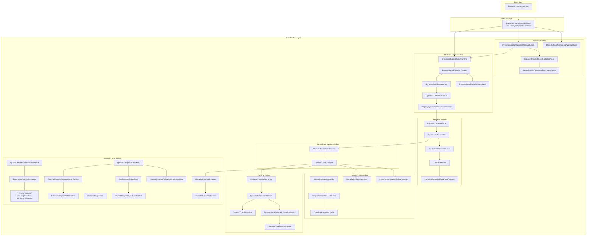
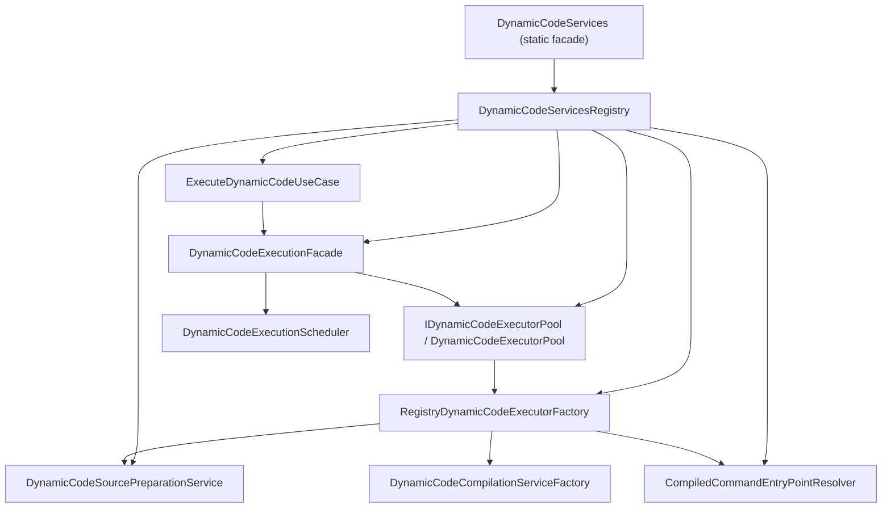

# execute-dynamic-code rebuild

This document describes the rebuilt `execute-dynamic-code` pipeline after the layering refactor.

The whole pipeline lives under `Packages/src/Editor/FirstPartyTools/ExecuteDynamicCode/` in the
`UnityCLILoop.FirstPartyTools.Editor` assembly. The `Entry` / `UseCase` / `Infrastructure` layers
below are the layering inside that tool plugin, not the onion assemblies around it.

## Layered overview

## Composition graph

The registry only knows the runtime-access collaborators above. `DynamicCodeCompilationServiceFactory`
just returns a `DynamicCodeCompiler`, whose default constructor is what builds the planning,
backend build, and safety/load collaborators (`DynamicCompilationPlanner`,
`CompiledAssemblyBuilder` with its path/reference/backend services, and
`CompiledAssemblyLoadService`). None of those are visible to the registry.

## Reading guide

1. Start with `Entry layer`.
   - `ExecuteDynamicCodeTool` only delegates the tool workflow.
2. Move to `UseCase layer`.
   - `ExecuteDynamicCodeUseCase` owns the user-facing workflow for execute-dynamic-code, including the
     foreground warm-up fallback that protects the first real execution after startup or reload.
3. Only then read `Infrastructure layer`.
   - `Runtime access module` is the only runtime-facing gateway.
   - `Warm-up module` keeps every warm-up entrypoint on the same snippets and request shape.
   - `Planning`, `Backend build`, `Safety + load`, and `Invocation` split the heavy mechanics into named modules.
4. Read `Composition graph` last.
   - `DynamicCodeServicesRegistry` is the only place that is expected to know many concrete classes at once.
   - If a concrete-to-concrete edge only appears there, it is a wiring edge rather than a runtime dependency.

Server startup and recovery do not enter this pipeline. `UnityCliLoopFirstPartyServerLifecycleBinding`
in `UnityCLILoop.CompositionRoot.Editor` is the readiness probe: it resets server-scoped services and
warms the project IPC transport with the internal `get-version` bridge command, so a user-disabled tool
cannot block startup. Dynamic-code warm-up is owned entirely by this pipeline — the use case's
foreground fallback, and the background prewarm inside `DynamicCodeExecutionScheduler`.

## Layer responsibilities

- `Entry layer`
  - Translate external calls into use-case invocations.
  - Avoid business workflow logic.
  - Avoid reaching into executor or compiler wiring directly.

- `UseCase layer`
  - Own temporal cohesion.
  - Decide the workflow order for the feature.
  - Keep user-facing retry rules such as the missing-`return` retry in one place.
  - Depend on runtime contracts instead of concrete infrastructure types.

- `Infrastructure layer`
  - Own the mechanics of execution, compilation, loading, caching, path discovery, and worker lifecycle.
  - Keep low-level concerns isolated behind contracts and focused service classes.

## Infrastructure module boundaries

- `Runtime access module`
  - Exposes `IDynamicCodeExecutionRuntime` to the use-case layer.
  - Reuses a single executor through `IDynamicCodeExecutorPool`.
  - Arbitrates foreground and idle-only execution through `DynamicCodeExecutionScheduler`.

- `Warm-up module`
  - Owns the snippet shapes every warm-up path compiles.
  - Keeps foreground fallback and background prewarm on the same sequence, so whichever runs first
    marks the same execution shape as ready.
  - Holds the "already warmed" state outside the use case.

- `Planning module`
  - Turns `CompilationRequest` into `DynamicCompilationPlan`.
  - Keeps wrapper generation and literal hoisting together.
  - Prevents `DynamicCodeCompiler` from knowing preparation details.

- `Backend build module`
  - Takes a plan and produces `CompiledAssemblyBuildResult`.
  - Owns reference resolution, auto-using retry, backend selection, temp artifact handling, and build timings.
  - Hides Roslyn worker details from the compiler orchestration.

- `Safety + load module`
  - Loads DLL bytes only after build success.
  - Keeps `Assembly.Load` isolated behind a focused loader service.
  - Prevents backend code from depending on assembly-load mechanics.

- `Invocation module`
  - Executes the compiled wrapper method through `ICompiledCommandInvoker`.
  - Keeps reflection-heavy entry-point resolution behind a focused facade.
  - Lets `DynamicCodeExecutor` stay a thin bridge between compile and invoke.

## Class responsibilities

- `ExecuteDynamicCodeTool`
  - Thin entry point for the CLI tool.
  - Delegates the full workflow to `IExecuteDynamicCodeUseCase`.

- `ExecuteDynamicCodeUseCase`
  - Converts parameters into the runtime request.
  - Performs the missing-`return` retry.
  - Runs the foreground warm-up sequence before the first real foreground execution, and skips it for
    compile-only and yield-to-foreground requests.
  - Shapes `ExecutionResult` into `ExecuteDynamicCodeResponse`.

- `IDynamicCodeExecutionRuntime`
  - Contract between use cases and runtime infrastructure.
  - Exposes `ExecuteAsync` for foreground work and `TryExecuteIfIdleAsync` for work that must not
    displace a foreground request.
  - Keeps use cases from depending on factory and executor wiring directly.

- `DynamicCodeExecutionFacade`
  - Reuses executors through `IDynamicCodeExecutorPool`.
  - Routes both entrypoints through `DynamicCodeExecutionScheduler` so foreground work can preempt
    background work.
  - Hides provider, pool, and scheduling wiring from use cases.

- `DynamicCodeForegroundWarmupRunner`
  - Compiles the shared warm-up snippets in sequence, either as foreground work or as idle-only work.
  - Exists so no warm-up path can report warm while a shape the user hits first is still cold.

- `DynamicCodeExecutorPool`
  - Owns executor reuse and disposal for the runtime access path.
  - Keeps that caching concern out of the runtime facade itself.

- `RegistryDynamicCodeExecutorFactory`
  - Builds `DynamicCodeExecutor` and `CommandRunner` from registered compiler services.
  - Lives in the composition graph and runtime infrastructure, not in the entry layer.

- `DynamicCodeExecutor`
  - Bridges compilation and execution.
  - Merges timing information.
  - Converts hoisted literals into execution parameters.

- `DynamicCodeCompiler`
  - Orchestrates cache lookup, source security, planning, build, and assembly load.
  - Depends on module facades instead of low-level helpers directly.

- `DynamicCompilationPlanner`
  - Produces the normalized `DynamicCompilationPlan`.
  - Keeps request normalization and source preparation together.

- `CompiledAssemblyBuilder`
  - Builds the assembly bytes from a plan.
  - Owns the auto-using retry loop and ambiguity rollback.

- `DynamicCodeSourcePreparationService` / `DynamicCodeSourcePreparer`
  - Normalize snippets into wrapper code.
  - Handle top-level mode, return completion, and literal hoisting.

- `DynamicCompilationBackend`
  - Chooses between the Roslyn path and the AssemblyBuilder fallback path inside the build module.

- `RoslynCompilerBackend` / `SharedRoslynCompilerWorkerHost`
  - Provide the fast path with the shared external worker.

- `CompiledAssemblyLoadService` / `CompiledAssemblyLoader`
  - Keep metadata validation, assembly loading, and IL validation together.

- `CommandRunner` / `CompiledCommandEntryPointResolver`
  - Execute the compiled wrapper method while hiding reflection-heavy lookup.
  - Form the `Invocation` facade seen by `DynamicCodeExecutor`.

## Design intent

- Make the architecture readable as `Entry -> UseCase -> Infrastructure`.
- Keep the runtime dependency chain narrower than the composition graph.
- Allow the composition root to know concrete classes, while runtime layers depend on contracts or use cases.
- Keep the `Infrastructure` layer readable as a set of named module facades instead of one large helper cluster.
- Keep the async-only contracts honest.
- Keep performance work in infrastructure without leaking that complexity into the entry layer.
